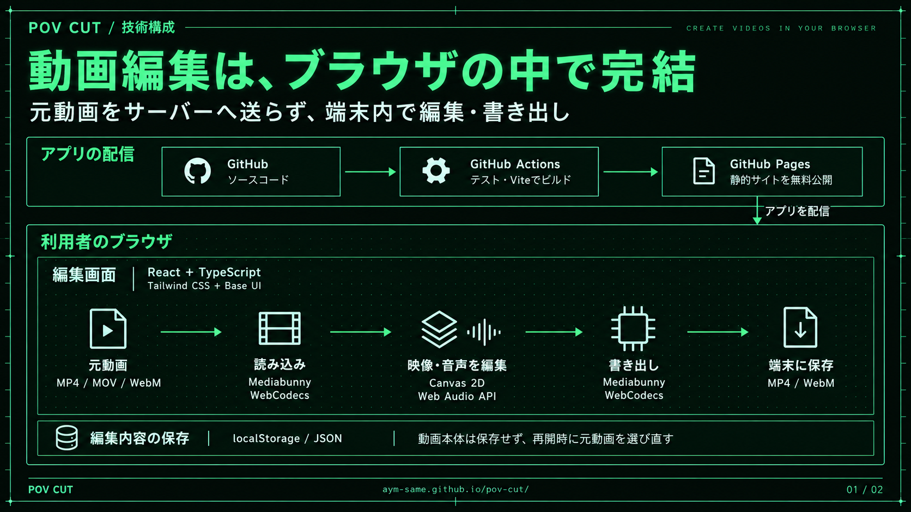
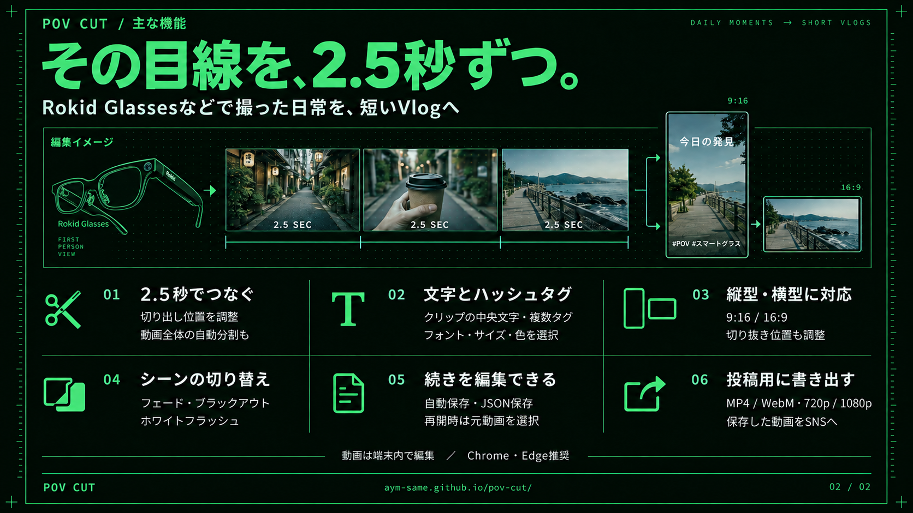

# POV CUT 説明資料

アプリの技術構成と主な機能を、各1枚の画像にまとめた資料です。2026年9月22日作成。PNGは各1672×941pxです。

**[スマートフォン向け閲覧ページ](https://aym-same.github.io/pov-cut/slides/)**

## ① 技術構成

GitHubでのアプリ配信と、ブラウザ内で行う動画編集・書き出しを図解しています。

[PNGを開く](../../public/slides/01-technical-architecture.png)

## ② 主な機能（最新版）

2.5秒のクリップ編集、文字・ハッシュタグ、縦横対応、切り替え効果、編集内容の保存、動画の書き出しを紹介しています。Rokid Glassesのイラストは公式製品写真を参照した修正版です。

[PNGを開く](../../public/slides/02-features-rokid-v2.png)

## 制作記録

- [2枚の画像生成プロンプト](generation-prompts.md)
- [Rokid Glassesのイラスト修正プロンプト・参照元](rokid-correction-prompt.md)
- [生成記録・画像サイズ・SHA-256](generation-metadata.json)
- [②の初版（修正前）](../../public/slides/02-features.png)

内蔵のimage_genで生成・部分編集しています。使用モデルのバージョンはツールから公開されていません。画像内の映像やメガネは説明用のイラストです。生成プロンプトに書かれた希望解像度と、実際の保存サイズは異なります。

PNGの保管場所は`public/slides/`です。`generation-metadata.json`の`file`はこのディレクトリ内のファイル名を表します。参照した公式製品写真はURLを記録しています。
